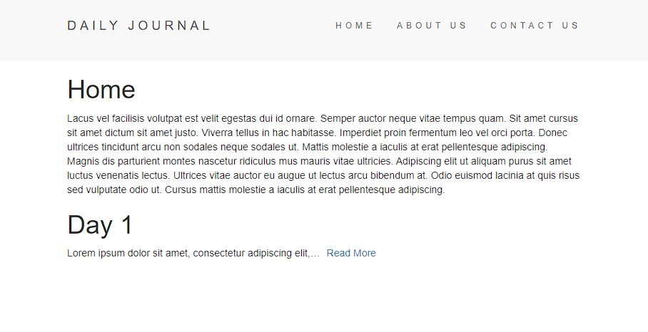
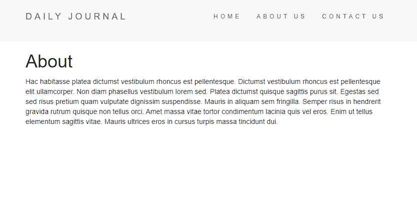
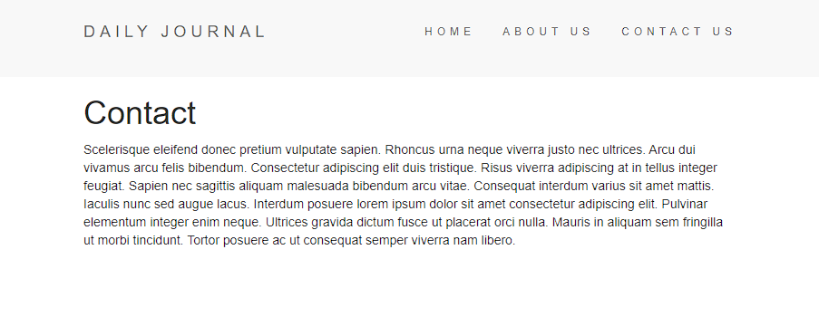
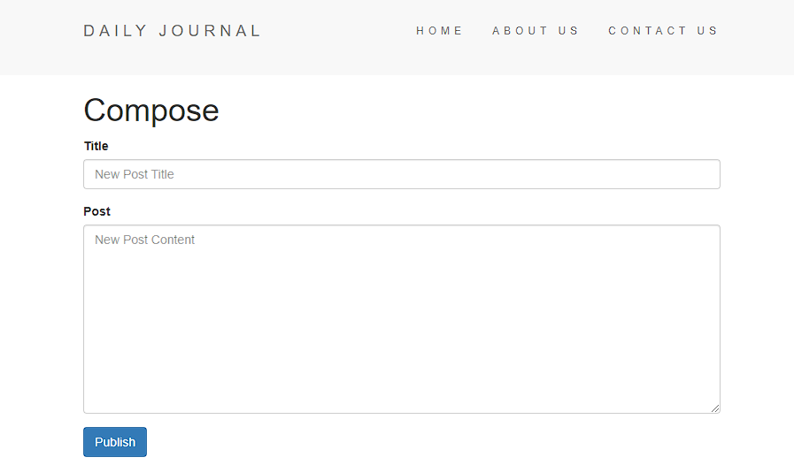
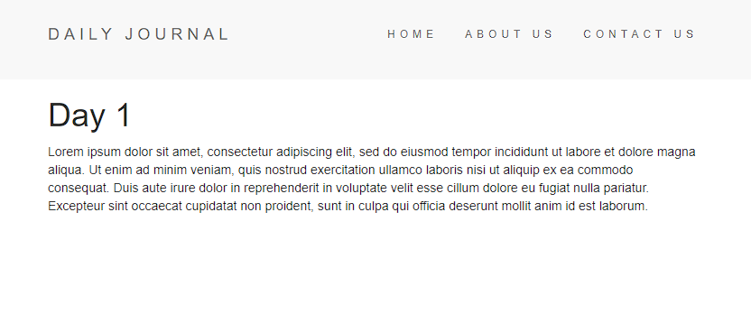

# Blog Post Template

## This web app is built using `NodeJS`, `Bootstrap`, and `EJS`

<hr/>

```
app.get('/', (req, res) => {
  res.render('home', { homeStartingContent, posts });
});
```



<hr/>

```
app.get('/about', (req, res) => {
  res.render('about', { aboutContent });
});
```


<hr/>

```
app.get('/contact', (req, res) => {
  res.render('contact', { contactContent });
});
```



<hr/>

```
app.get('/compose', (req, res) => {
  res.render('compose');
});

app.post('/compose', (req, res) => {
  let post = {
    id: posts.length + 1,
    title: req.body.newPostTitle,
    content: req.body.newPostContent
  }
  
  posts.push(post);

  res.redirect('/');
});
```



<hr/>


```
app.get('/post/:post_id', (req, res) => {
  let post_id = req.params.post_id;

  let post = posts.find(post => post.id == post_id);

  res.render('post', { post });
});
```

