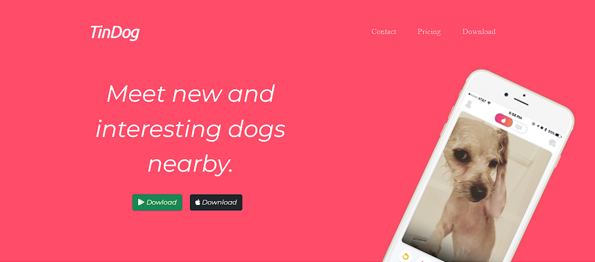
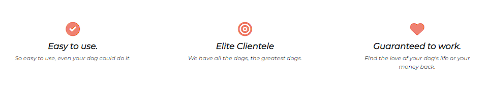
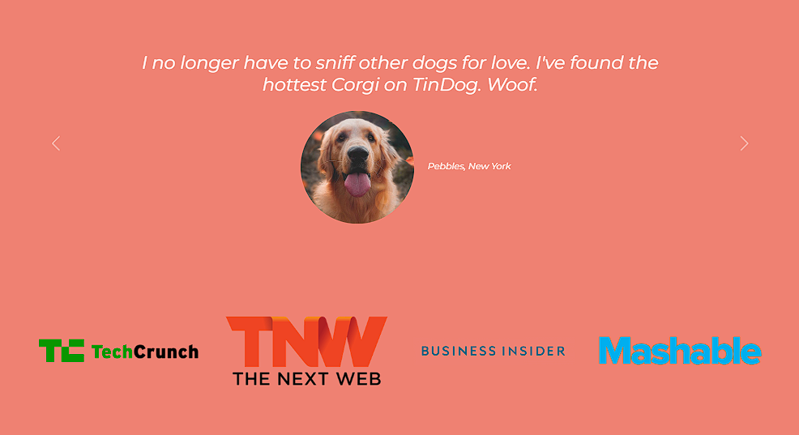
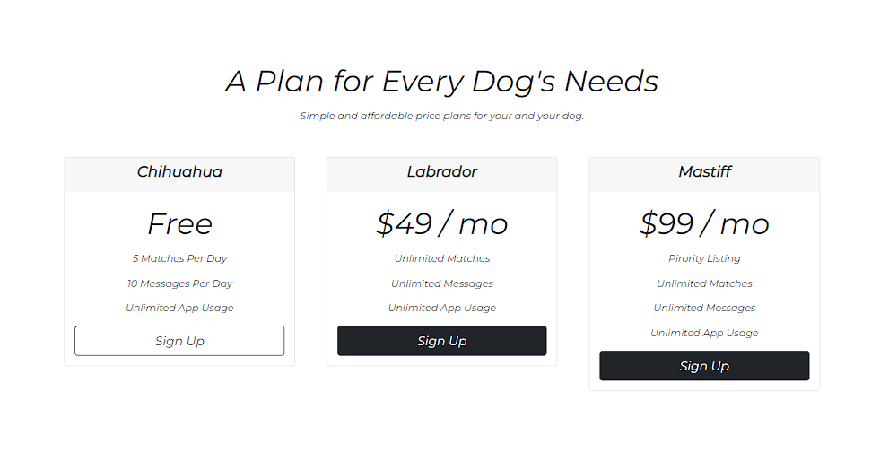

# TinDog App

## TinDog app is a social media platform where dogs can meet their paw-mates with easy layout where the user needs to swipe left or right based on their preferences.

## Project built by using `HTML`, `Bootstrap5` and `CSS`

## Website consists of 5 sections in total:
1. Title section covers navigation bar with menu item selections. Greetings message with download option provided based on user's device and snippet of application.

2. Features section to provide user what he needs to expect from the app.

3. Testimonials and Press section displayed using bootstrap5 carousel to show user feedbacks from our current happy customers.

4. Pricing section shows the user the subscription cost and the list of services that comes with each subscription.
 
5. Call to Action and Footer sections provides buttons to download the app and list of social media outlets user can connect with TinDog.

