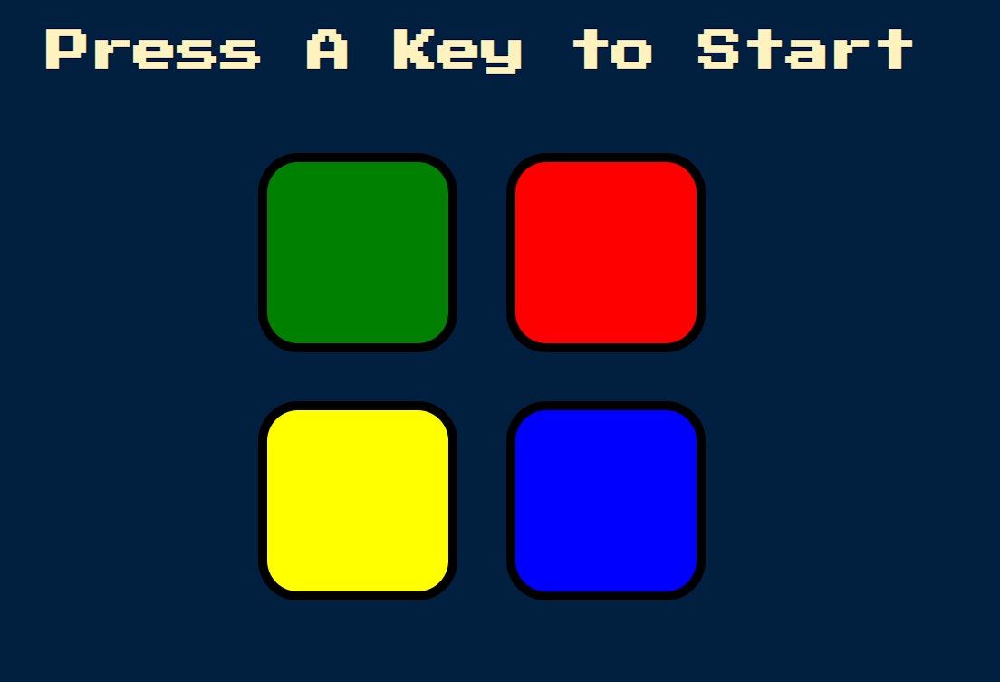
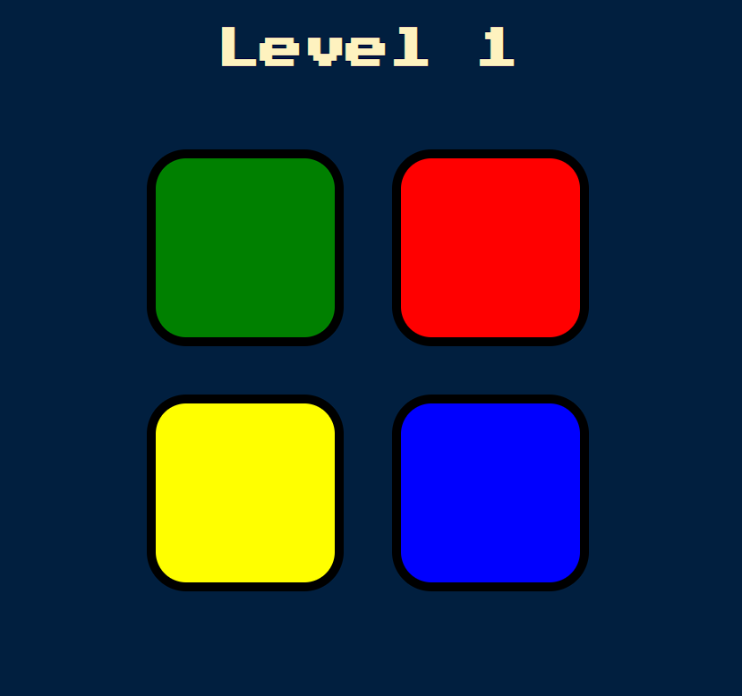
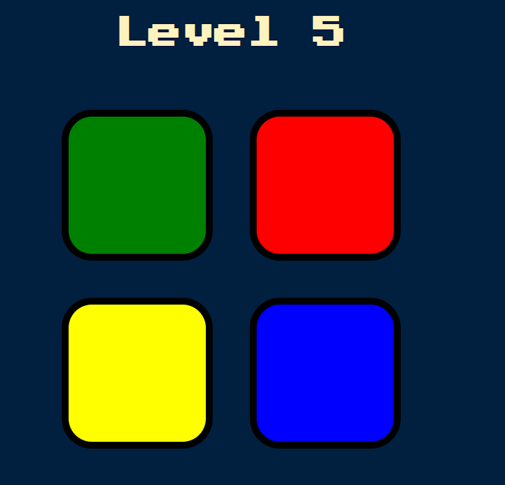
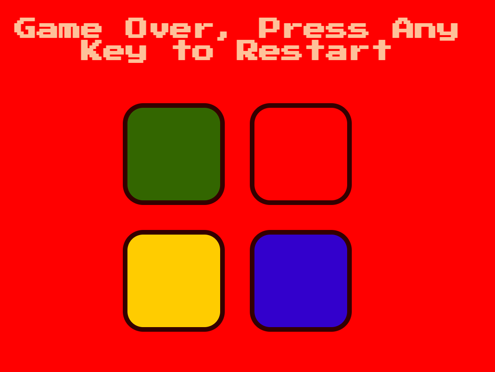

# Simon Says Game

## Simple simon game to demonstrate `jquery` use and algorithm. 

## Project built by using `HTML`, `JQuery` and `CSS`

1. When Page loads, it will ask user to press any key on keyboard to launch the game.

2. Once game is launched, code will generate a sequence and play the sequence.

3. Once user repeats the game sequence, user will level up and logic will be adding extra sequence per level user achieved.

4. When user makes a mistake on finding the correct sequence, the game will end and game-over page code will fire.
 
